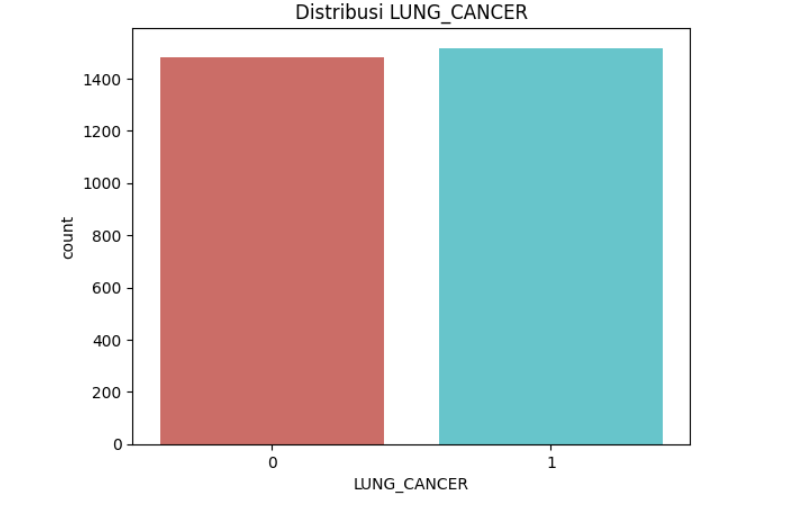
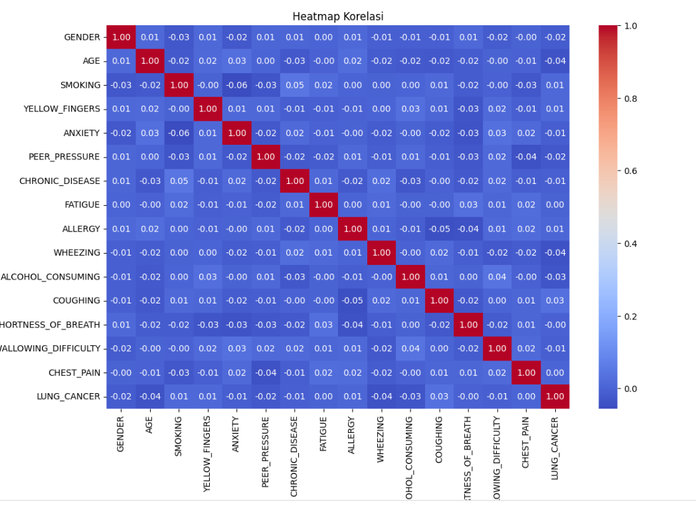
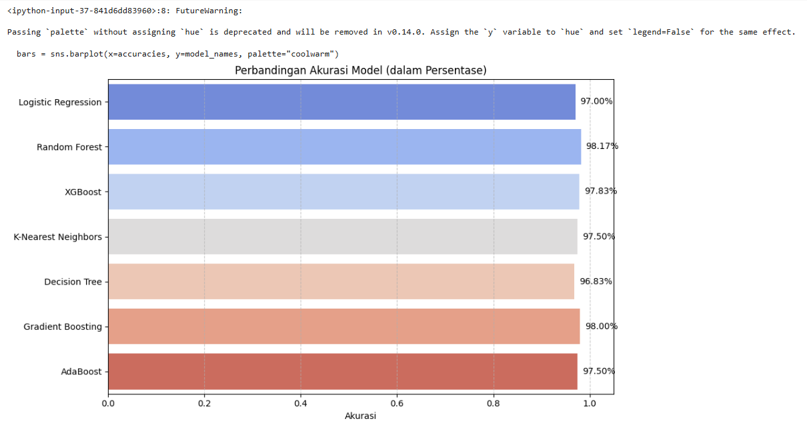
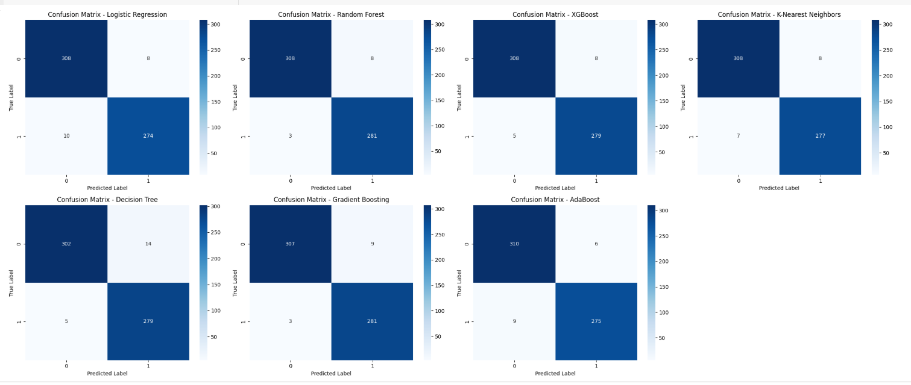

# Laporan Proyek Machine Learning – Prediksi Risiko Kanker Paru-Paru

## Domain Proyek

Kanker paru-paru adalah salah satu penyakit dengan tingkat kematian tertinggi secara global. Keterlambatan diagnosis menyebabkan rendahnya tingkat kelangsungan hidup. Oleh karena itu, penerapan teknologi Machine Learning (ML) dalam deteksi dini dan klasifikasi kanker paru-paru menjadi sangat penting untuk meningkatkan outcome klinis pasien.

Gao et al. (2023) menekankan bahwa ML memungkinkan prediksi efikasi imunoterapi secara lebih tepat melalui pemodelan PD-L1, TMB, dan TME secara non-invasif. Dritsas & Trigka (2022) mengembangkan model ML berbasis data gejala untuk skrining awal kanker paru dengan akurasi tinggi. Li et al. (2022) menyimpulkan bahwa integrasi imaging dan omics data melalui ML dapat memperkuat diagnosis dan prediksi prognosis kanker paru.

**Referensi Ilmiah:**

* Gao et al., 2023. *Artificial Intelligence and Machine Learning in Lung Cancer Immunotherapy*. Journal of Hematology & Oncology, 16(55). [https://doi.org/10.1186/s13045-023-01456-y](https://doi.org/10.1186/s13045-023-01456-y)
* Dritsas & Trigka, 2022. *Lung Cancer Risk Prediction with Machine Learning Models*. BDCC, 6(139). [https://doi.org/10.3390/bdcc6040139](https://doi.org/10.3390/bdcc6040139)
* Li et al., 2022. *Machine Learning for Lung Cancer Diagnosis, Treatment, and Prognosis*. Genomics, Proteomics & Bioinformatics, 20(5), 850–866. [https://doi.org/10.1016/j.gpb.2022.11.003](https://doi.org/10.1016/j.gpb.2022.11.003)

---

## Business Understanding

### Problem Statements

* Bagaimana mengidentifikasi individu dengan risiko tinggi terkena kanker paru-paru berdasarkan data klinis sederhana?
* Algoritma klasifikasi ML apa yang memberikan akurasi terbaik dalam prediksi kanker paru-paru?

### Goals

* Membangun model klasifikasi risiko kanker paru berdasarkan data non-invasif.
* Membandingkan performa beberapa algoritma klasifikasi ML dan memilih model terbaik.

### Solution Statements

* Menggunakan 7 algoritma: Logistic Regression, Random Forest, XGBoost, KNN, Decision Tree, Gradient Boosting, dan AdaBoost.
* Evaluasi menggunakan 4 metrik utama: Accuracy, Precision, Recall, dan F1-score.
* Pemilihan model terbaik berdasarkan kombinasi metrik tertinggi.

---

## Data Understanding

Dataset digunakan berasal dari [Kaggle - Lung Cancer Dataset](https://www.kaggle.com/datasets/akashnath29/lung-cancer-dataset) dengan format data klinis (non-imaging).

* Jumlah entri: 3000 observasi
* Fitur: 15 variabel input dan 1 target (`LUNG_CANCER`)
* Variabel meliputi usia, jenis kelamin, riwayat merokok, gejala (batuk, sesak napas, nyeri dada), dan kebiasaan hidup lainnya.

### Variabel:

* Numerik: `AGE`
* Kategorikal/Biner: `GENDER`, `SMOKING`, `YELLOW_FINGERS`, `ANXIETY`, `COUGHING`, dll.
* Target: `LUNG_CANCER` (Yes/No)

### Visualisasi Distribusi Target

*Gambar 1. Distribusi kelas target: jumlah kasus kanker paru-paru positif dan negatif.*

### Heatmap Korelasi

*Gambar 2. Korelasi antar fitur prediktor terhadap variabel target.*

---

## Data Preparation

Langkah-langkah yang dilakukan:

1. **Encoding:** Label Encoding untuk semua variabel kategorikal.
2. **Normalisasi:** Menggunakan StandardScaler untuk fitur numerik, mendukung performa KNN.
3. **Train-Test Split:** 80% untuk pelatihan, 20% untuk pengujian.
4. **Data Cleaning:** Menghapus duplikasi untuk mencegah bias model.

**Alasan:**

* Encoding diperlukan untuk algoritma ML yang tidak menerima data kategorikal.
* Normalisasi penting untuk model berbasis jarak seperti KNN.
* Train-test split dilakukan untuk evaluasi generalisasi model.

---

## Modeling

### Algoritma yang Digunakan:

* Logistic Regression
* Random Forest
* XGBoost
* K-Nearest Neighbors (KNN)
* Decision Tree
* Gradient Boosting
* AdaBoost

### Parameter Penting:

* Logistic Regression: `max_iter=10000`
* XGBoost: `use_label_encoder=False, eval_metric='logloss'`
* KNN: `n_neighbors=10`

### Perbandingan Singkat:

| Algoritma           | Kelebihan            | Kekurangan                                   |
| ------------------- | -------------------- | -------------------------------------------- |
| Logistic Regression | Cepat, sederhana     | Tidak cocok untuk relasi non-linear kompleks |
| Random Forest       | Stabil dan akurat    | Sulit diinterpretasi                         |
| XGBoost             | Sangat presisi       | Perlu tuning parameter                       |
| KNN                 | Mudah dipahami       | Tidak efisien di dataset besar               |
| Decision Tree       | Mudah diinterpretasi | Rentan overfitting                           |
| Gradient Boosting   | Sangat akurat        | Kompleks dan lambat                          |
| AdaBoost            | Mengatasi bias       | Sensitif terhadap outlier                    |

---

## Evaluation

### Metrik Evaluasi yang Digunakan:

* **Accuracy** = (TP + TN) / (Total)
* **Precision** = TP / (TP + FP)
* **Recall** = TP / (TP + FN)
* **F1-score** = 2 × (Precision × Recall) / (Precision + Recall)

### Visualisasi Perbandingan Metrik Model

*Gambar 3. Visualisasi perbandingan skor akurasi antar model ML.*

### Confusion Matrix

*Gambar 4. Confusion matrix pada model – performa klasifikasi.*

### Hasil Evaluasi Model:

| Model               | Accuracy | Precision | Recall | F1-Score |
| ------------------- | -------- | --------- | ------ | -------- |
| Logistic Regression | 0.9700   | 0.9700    | 0.9700 | 0.9700   |
| Random Forest       | 0.9817   | 0.9818    | 0.9817 | 0.9817   |
| XGBoost             | 0.9783   | 0.9784    | 0.9783 | 0.9783   |
| KNN                 | 0.9750   | 0.9750    | 0.9750 | 0.9750   |
| Decision Tree       | 0.9683   | 0.9688    | 0.9683 | 0.9684   |
| Gradient Boosting   | 0.9800   | 0.9802    | 0.9800 | 0.9800   |
| AdaBoost            | 0.9750   | 0.9750    | 0.9750 | 0.9750   |

### Model Terbaik:

**Random Forest** dipilih sebagai model terbaik karena memiliki nilai akurasi dan metrik lainnya yang paling unggul dan stabil.

##  Kesimpulan
Pendekatan ML dapat memberikan akurasi tinggi dalam prediksi kanker paru-paru. Random Forest terbukti paling unggul dalam eksperimen ini.

##  Saran
- Terapkan K-Fold CV untuk validasi lebih kuat.
- Eksplorasi integrasi data imaging & genomik.
- Potensial dikembangkan menjadi aplikasi skrining medis.

---
